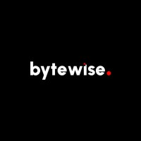

# BYTE WISE FELLOWSHIP
`The repository contains all the tasks and documentation which are used in this fellowship program .You can checkout this for exploring and understanding dart and flutter.I hope it will help you alot `

This includes all the necessary concepts of Dart Programming language which are essential for Flutter Developers

Learning --> Dart june 2024 -- spring'24
